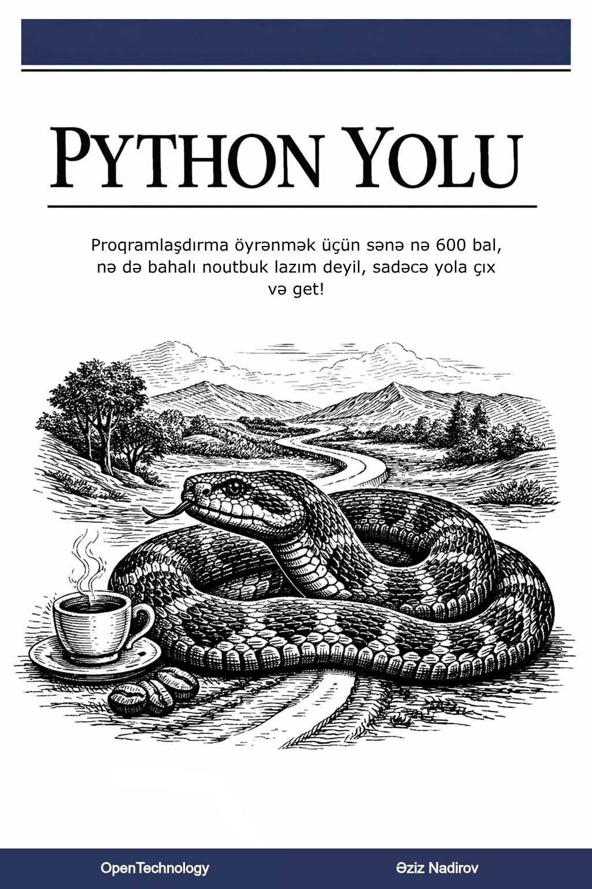

# Python Yolu

### Nümunə kodlar və Tapşırıqların həll nümunələri

Hey, burda "Python Yolu" kitabımın nümunə kodlarının həll nümunələri yer alır. Əlavə olaraq.

> **Kitabdakı nümunələr**: `code/examples/` qovluğunda yerləşir.Hər bir skript özündə kitabdakı bölmənin nömrəsini və adını saxlayır. Burada ancaq nisbətən uzun kod nümunələri yer alır.
---
> **Tapşırıqların həll nümunələri**: `code/tasks/` qovluğunda yerləşir və hər bir bölmənin tapşırıqları bölmənin adı və nömrəsinə uyğun adlandırılmış jupyter noutbukda(`.ipynb` genişlənməli) yerləşir.

